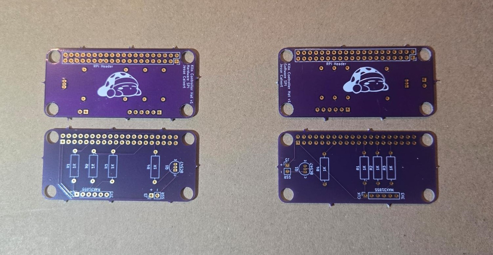

# Kiln Controller HATs
HATs to implement [jbruce12000/kiln-controller](https://github.com/jbruce12000/kiln-controller) in Raspberry Pi Zero W form-factor.

## Two PCBs
There are two PCBs for controlling the MAX31855 in either software (right) or hardware(left) SPI. The software PCB has a cleaner layout with traces, but is allegedy slower.

## BOM
In addition to the regular materials for jbruce12000's controller, you will need:

* 1x6 socket header with 2.54mm pitch (MAX31855)
* 2x20 socket header with 2.54mm pitch (RPi GPIO)
* 1x2 pin or socket header with 2.54 pitch (SSR)

## Assembly
Ensure the GPIO header gets soldered to the back of the board. Solder in the resistors, transistor, and socket headers. The hat is attached to use the entire GPIO header, although it only uses a small number of pins.

The MAX31855 is attached upside down onto the board. This is because I already soldered my pins rightside up and I didn't want to resolder or buy a new MAX. The design would need to be changed to flip the MAX header around for a cleaner looking install.

Remember to update your config.py to reflect which pins you are using. Hardware SPI should define no pins. The software SPI board uses these pins:

| Physical Pin | GPIO | Connected to | config.py line        |
| ------------ | ---- | ------------ |-----------------------|
| 23           | 11   | MAX31855 CLK | spi_sclk = board.D11  |
| 27           | 0    | MAX31855 CS  | spi_cs = board.D0     |
| 31           | 6    | MAX31855 DO  | spi_miso = board.D6   |
| 13           | 27   | SSR Control  | gpio_heat = board.D27 |

Set spi_mosi (serial input) to any unused pin, such as D10.

The board has the same dimensions as the Raspberry Pi Zero W, because that's the device I happened to have for this project. Drill holes are aligned to match that device, so maybe someone could make a nice 3D printed case for the whole assembly. Due to this, the board does have a lot of unused space, so the design can also be adjusted to save some manufacturing cost. Alternatively, maybe some additional features could be added, although I don't have the electronics skill for that.

## Thanks
Thank you [jbruce12000](https://github.com/jbruce12000) for reviving dead analog kilns with Raspberry Pi magic, and [Tech Explorations](https://techexplorations.com/) for teaching me the basics of KiCAD. These are my first PCB designs, so feedback would be welcome.
